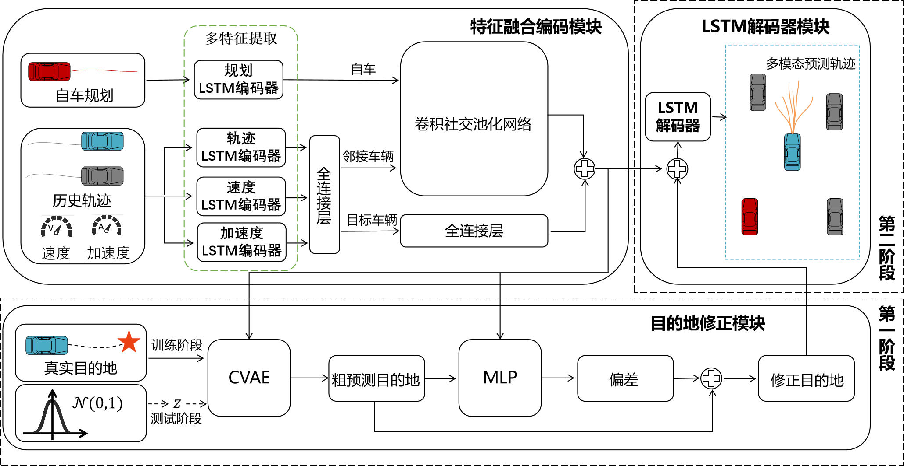

# Two-stage Vehicle Trajectory Prediction Method Based on Goal and Multi-feature Fusion(TGMF)

## Running
python train.py --name TGMF --batch_size 64 --pretrain_epochs 15  --train_set ./datasets/NGSIM/train.mat --val_set ./datasets/NGSIM/val.mat  --order 2

python evaluate.py --name TGMF --batch_size 64 --test_set ./datasets/NGSIM/test.mat --order 2

## Documentation
- model.py : It contains the concrete details of the proposed TGMF architecture.
- train.py : It contains the detailed approach for training TGMF model.
- evaluate.py : It contains the approach for evaluating a trained model.
- minnedata.py : It contains the customized dataset class for handling and batching trajectory data
- utils.py : It contains the loss calculation functions and some other helper functions.

## Visualization

